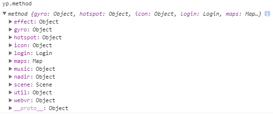

# 功能方法

在浏览器调试中输入 `yp.method` 可以查看开发的所有方法。

方法名 | 类型 | 作用
-----|------|----
effect | Object | 特效基础方法
gyro | Object | 陀螺仪基础方法
hotspot | Object | 热点
icon | Object | 热点样式
login | Login | 登陆接口
maps | Map | 地图
music | Object | 音乐
nadir | Object | 补天补地
scene | Scene |  场景
util | Object | 公用方法
webvr | Object | web VR 

功能方法不受yp配置项限制，会全部调用。